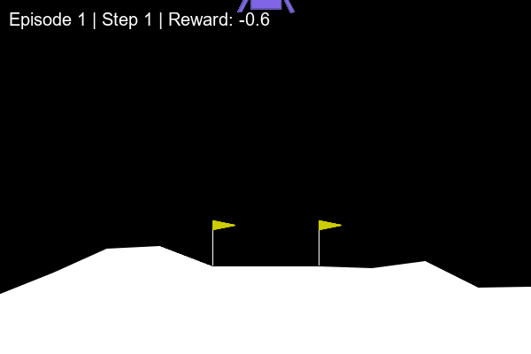
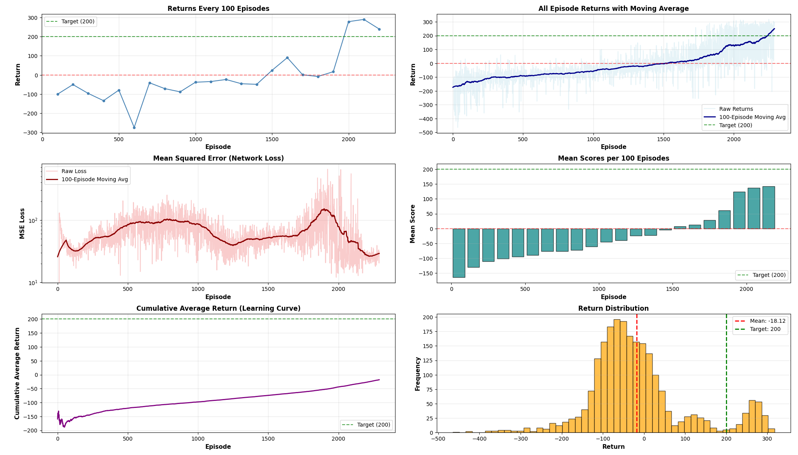
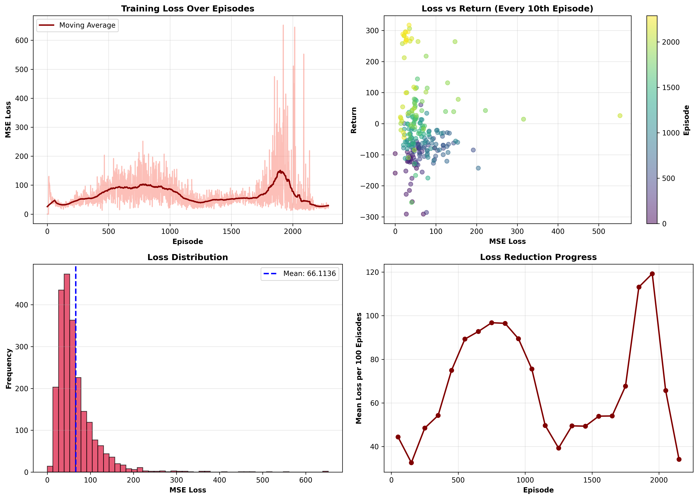

# LunarLander DQN Agent

This project implements a Deep Q-Network (DQN) to train an agent in the `LunarLander-v3` environment from Gymnasium. The goal is to achieve a reward threshold greater than 200 using reward shaping and exploration strategies. Training is optimized to complete in under 2 hours on standard CPU/GPU setups.

## 📋 Table of Contents

- [Overview](#overview)
- [Environment](#environment)
- [Algorithm](#algorithm)
- [Project Structure](#project-structure)
- [Installation](#installation)
- [Usage](#usage)
- [Reward Shaping & Exploration Strategies](#reward-shaping--exploration-strategies)
- [Results](#results)
- [File Descriptions](#file-descriptions)
- [Key Observations](#key-observations)

## 🎯 Overview

This project demonstrates the application of Deep Q-Network (DQN) to solve the LunarLander-v3 control problem. The implemented algorithm uses experience replay and target networks to achieve stable learning.

## 🎮 Environment

### LunarLander-v3
A space lander must navigate and land safely on a landing pad using its thrusters.

- **State Space**: 8-dimensional (x, y, vx, vy, angle, angular velocity, left leg contact, right leg contact)
- **Action Space**: 4 discrete actions (do nothing, fire left engine, fire main engine, fire right engine)
- **Goal**: Land safely on the landing pad between the flags with reward > 200

## 🧠 Algorithm

### Deep Q-Network (DQN)
DQN is a value-based reinforcement learning algorithm that uses a deep neural network to approximate the Q-function.

**Key Features:**
- Experience Replay Buffer
- Target Network
- Epsilon-Greedy Exploration
- Reward Shaping

## 📁 Project Structure

```
.
├── train.py              # Training script for DQN agent
├── model.py              # DQN neural network architecture
├── utils.py              # Replay buffer and helper functions
├── create_graphs.py      # Generate training performance plots
├── run_agent.py          # Save trained agent video
├── watch_agent.py        # Visualize trained agent in real-time
├── requirements.txt      # Project dependencies
├── dqn_lander.pth        # Saved trained model
├── rewards.npy           # Saved rewards per episode
├── losses.npy            # Saved losses per training step
└── recordings/           # Agent performance videos and GIFs
```

## 🚀 Installation

### Prerequisites
- Python 3.10+
- pip or conda

### Install Dependencies

```bash
pip install -r requirements.txt
```

Or install dependencies individually:

```bash
pip install torch>=2.0.0
pip install gymnasium>=0.29.0
pip install numpy>=1.24.0
pip install matplotlib>=3.7.0
pip install scipy>=1.10.0
pip install imageio>=2.31.0
pip install imageio-ffmpeg>=0.4.9
pip install Pillow>=10.0.0
```

**Note:** For Box2D support (required for LunarLander), you may need to install additional system dependencies:
```bash
# On Ubuntu/Debian
sudo apt install swig

# Then install gymnasium with box2d
pip install gymnasium[box2d]
```

## 💻 Usage

### 1. Training the Agent

Train the DQN agent on the LunarLander-v3 environment:

```bash
python train.py
```

The training process will:
- Train the DQN agent on the LunarLander-v3 environment
- Save the trained model to `dqn_lander.pth`
- Save rewards per episode to `rewards.npy`
- Save training losses to `losses.npy`

### 2. Visualize Training Performance

After training is complete, generate plots of rewards and losses:

```bash
python create_graphs.py
```

This will create visualization plots showing:
- Reward per episode over time
- Training loss over time

### 3. Save Agent Video

Record a video of the trained agent's performance:

```bash
python run_agent.py
```

This will save a video of the agent to the `recordings/` directory.

### 4. Watch Agent in Real-Time

Visualize the trained agent interacting with the environment:

```bash
python watch_agent.py
```

This will open a window showing the agent's performance in real-time.

## 🔬 Reward Shaping & Exploration Strategies

### 1. Reward Shaping
Reward shaping involves modifying the environment's reward signal to encourage the agent to learn specific behaviors. In the LunarLander-v3 environment, the following adjustments were made to the reward function:

- **Proximity to Landing Pad**: The reward increases as the agent gets closer to the landing pad
- **Speed Control**: A penalty is added for fast horizontal movement, while slower movement is encouraged. However, when the Lander reaches closer to the ground, some horizontal movement is encouraged to allow it to move without needing excessive tilt
- **Angular Tilt**: A penalty is added for excessive tilt, discouraging the agent from landing with an unstable angle

### 2. Exploration Strategy
The agent employs an **epsilon-greedy policy**, where:
- The agent explores the environment with a random action with probability ε
- The agent exploits its learned policy with probability 1 - ε
- The epsilon value decays over time to balance exploration and exploitation as the agent learns

### 3. Key DQN Components

- **Experience Replay Buffer**: Stores the agent's experiences (state, action, reward, next state, done) for later use in training
- **Target Network**: Separate network for stable Q-value targets during training
- **Neural Network Architecture**: Deep neural network with fully connected layers that takes environment state as input and outputs Q-values for each action

## 📊 Results

### Trained Agent Performance



**Reward Achieved**: 244 (Target: >200)

The trained agent successfully learned to land on the pad with stable control, achieving rewards well above the target threshold of 200.

### Training Performance Plots

#### Comprehensive Training Analysis


This plot shows the complete training analysis including rewards over episodes and learning progress.

#### Loss Analysis


This plot displays the training loss over time, showing how the Q-network's predictions improved during training.

## 📝 File Descriptions

### Core Files

- **train.py**: Training script that handles the DQN training loop, environment setup, model initialization, experience replay, and saves training metrics
- **model.py**: Defines the Deep Q-Network architecture using PyTorch with fully connected layers
- **utils.py**: Contains the replay buffer implementation and helper functions for preprocessing and experience sampling
- **create_graphs.py**: Generates visualization plots from saved training data (rewards and losses)
- **run_agent.py**: Loads the trained model and saves a video recording of the agent's performance
- **watch_agent.py**: Displays real-time visualization of the trained agent interacting with the environment

### Output Files

- **dqn_lander.pth**: Saved trained model weights
- **rewards.npy**: Rewards per episode during training
- **losses.npy**: Training losses over time

## 🔑 Key Observations

- **Stable Learning**: DQN with experience replay and target networks provides stable training
- **Reward Shaping**: Custom reward modifications help guide the agent toward desired behaviors
- **Epsilon Decay**: Gradual reduction in exploration allows the agent to exploit learned knowledge
- **Convergence**: The agent achieves target performance (>200 reward) within 2 hours of training

## 📝 License

This project is part of an academic assignment for the Reinforcement Learning course.

## 👥 Author

Created for RL Assignment 3 - 7th Semester

---

**Note**: The GIF showcases the trained agent's performance after completing the training process. Run `create_graphs.py` to see detailed learning curves.
